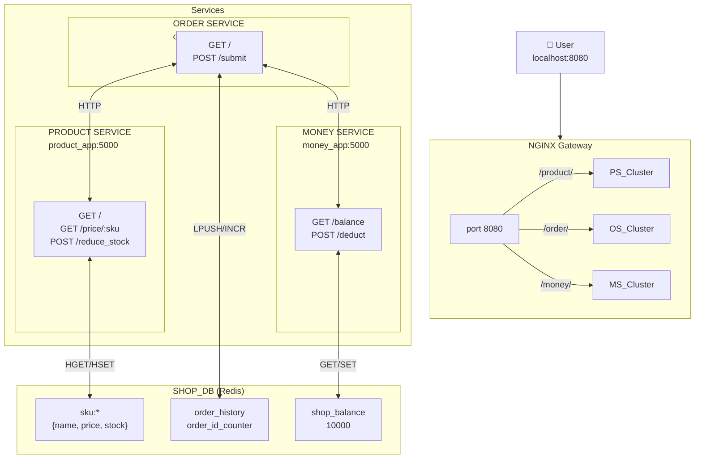
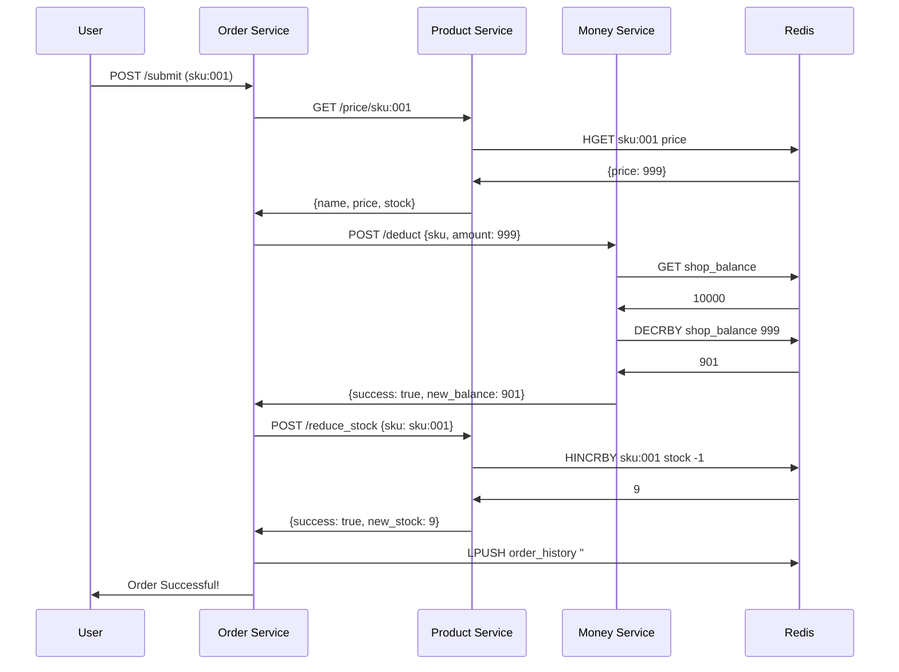

# Software Architecture: Service-Based Architecture Style

# Assignment: Add a Money Service

## Background
The current system (https://github.com/lunarlunarll123/Service-Based) already includes:
- Product Service
- Order Service
- one shared database
- Nginx / API Gateway

Your task is to extend this service-based architecture by adding a new Money Service:
1. Each phone must have its own price. You set the price.
2. The initial total balance is 10000.
3. After each successful Place Order, the total balance must decrease.
4. Create a separate Money Service to manage the balance.
5. All services must continue to share one database.

What to Do:
- Update Order Service to support phone price.
- Create a new Money Service for:
    - initializing the balance
    - checking the current balance
    - deducting money after an order
- Update Order Service so that a successful order reduces the balance.
- Update docker-compose.yml to include the new service.
- Update Nginx routing if needed.
- Update the front-end page to show:
    - phone prices
    - current balance
    - updated balance after ordering

Rules
- Do not put money-related logic inside Product Service.
- Keep service responsibilities separate.
- Keep the current service-based architecture with one shared database.
- You can use AI to check the API usage and generate codes. It helps you to understand how to use AI in code generation. This rule only works on this project.
- You need to design a beautiful UI interaction.

---

## Architecture Diagram

### System Architecture (ASCII)

```
┌─────────────────────────────────────────────────────────────────────────────────┐
│                                    USER                                          │
│                           http://localhost:8080                                  │
└─────────────────────────────────────┬───────────────────────────────────────────┘
                                      │
                                      ▼
┌─────────────────────────────────────────────────────────────────────────────────┐
│                              NGINX (API Gateway)                                  │
│                              localhost:8080                                       │
│                                                                                  │
│   /product/*  ──────────────────► product_cluster (product_app:5000)            │
│   /order/*   ───────────────────► order_cluster (order_app:5000)                │
│   /money/*   ───────────────────► money_cluster (money_app:5000)                 │
└─────────────────────────────────────┬───────────────────────────────────────────┘
                                      │
              ┌───────────────────────┼───────────────────────┐
              │                       │                       │
              ▼                       ▼                       ▼
┌─────────────────────────┐ ┌─────────────────────────┐ ┌─────────────────────────┐
│    PRODUCT SERVICE       │ │      ORDER SERVICE      │ │     MONEY SERVICE       │
│     (product_app)        │ │      (order_app)        │ │      (money_app)        │
├─────────────────────────┤ ├─────────────────────────┤ ├─────────────────────────┤
│ Bounded Context:        │ │ Bounded Context:        │ │ Bounded Context:        │
│   Inventory             │ │   Checkout Orchestration│ │   Balance Management    │
├─────────────────────────┤ ├─────────────────────────┤ ├─────────────────────────┤
│ Endpoints:              │ │ Endpoints:              │ │ Endpoints:              │
│ • GET /                 │ │ • GET /                 │ │ • GET /balance          │
│   → Product list        │ │   → Checkout UI        │ │   → Current balance     │
│ • GET /price/<sku>      │ │ • POST /submit          │ │ • POST /deduct          │
│   → {name,price,stock}  │ │   → Place order        │ │   → Deduct amount       │
│ • POST /reduce_stock    │ │                         │ │                         │
│   → Reduce stock        │ │ Responsibilities:       │ │ Responsibilities:       │
│                         │ │ • Render UI             │ │ • Initialize balance    │
│ Data Owned (Redis):     │ │ • Fetch product info   │ │ • Check balance         │
│ • sku:001 {name,price,  │ │ • Call money service    │ │ • Deduct/rollback       │
│       stock}            │ │ • Call product service │ │                         │
│ • sku:002 {...}         │ │ • Log order history    │ │ Data Owned (Redis):     │
│ • sku:003 {...}         │ │                         │ │ • shop_balance (int)    │
│                         │ │ Data Owned (Redis):    │ │                         │
└─────────────────────────┘ │ • order_history (list) │ └─────────────────────────┘
                             │ • order_id_counter     │             │
                             └─────────────┬───────────┘             │
                                           │    Shared Database        │
                                           ▼    ┌──────────────────────┘
                              ┌──────────────────────────────┐
                              │         SHOP_DB (Redis)       │
                              │                              │
                              │  Keys by Service:            │
                              │                              │
                              │  [Product Service]           │
                              │    sku:001 → {name,price,    │
                              │             stock}           │
                              │    sku:002 → {...}          │
                              │    sku:003 → {...}           │
                              │                              │
                              │  [Money Service]            │
                              │    shop_balance → 10000      │
                              │                              │
                              │  [Order Service]            │
                              │    order_history → [...]    │
                              │    order_id_counter → 1      │
                              │                              │
                              └──────────────────────────────┘
```

### Order Flow Sequence (ASCII)

```
┌─────────────────────────────────────────────────────────────────────────────┐
│                          PLACE ORDER SEQUENCE                                │
└─────────────────────────────────────────────────────────────────────────────┘

  User          Order Svc       Product Svc       Money Svc        Redis
    │                │                │                │              │
    │──POST /submit──▶│                │                │              │
    │                │                │                │              │
    │                │──GET /price/───▶│                │              │
    │                │◀──{name,price}─│                │              │
    │                │                │                │              │
    │                │─POST /deduct──▶│                │              │
    │                │                │──GET balance───▶│              │
    │                │                │◀─10000─────────│              │
    │                │                │◀─deduct $999───│              │
    │                │                │◀─{new_balance}──│              │
    │                │◀─200 OK────────│                │              │
    │                │                │                │              │
    │                │─POST /reduce──▶│                │              │
    │                │  _stock        │                │              │
    │                │                │──HINCRBY -1────▶sku:001 stock│
    │                │◀─200 OK────────│                │              │
    │                │                │                │              │
    │                │─────────────────────────────LPUSH order_history│
    │                │                                  │              │
    │◀─Order #1 OK───│                                  │              │
    │                │                                  │              │
```

### System Architecture (Mermaid)



### Order Flow Sequence (Mermaid)



### Service Responsibilities Summary

| Service | Bounded Context | Data Owned | Key Endpoints |
|---------|-----------------|------------|---------------|
| Product Service | Inventory | `sku:*` (name, price, stock) | `GET /`, `GET /price/:sku`, `POST /reduce_stock` |
| Order Service | Checkout Orchestration | `order_history`, `order_id_counter` | `GET /`, `POST /submit` |
| Money Service | Balance Management | `shop_balance` | `GET /balance`, `POST /deduct` |

### Key Architecture Decisions

1. **Shared Database, Isolated Keys**: All services share one Redis instance but use different key prefixes/namespaces for data isolation
2. **No Money Logic in Product Service**: Balance operations are exclusively handled by Money Service
3. **Order Service as Orchestrator**: Handles UI rendering and coordinates between Product and Money services
4. **Dynamic Price Lookup**: Order Service queries Product Service at runtime for current prices (no hardcoded data)
